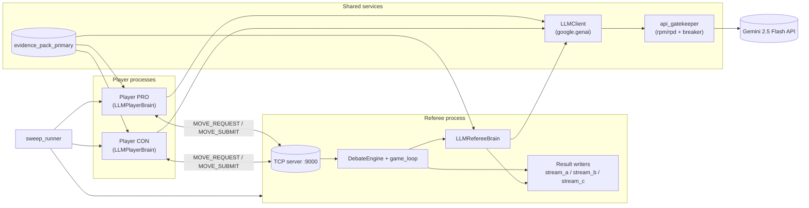

# Architecture

The Mermaid source in [architecture.mmd](architecture.mmd) describes the runtime topology:

## Layers

| Layer | Purpose |
|---|---|
| **Sweep runner** | Spawns one referee process + two player processes per match; iterates `(seed, judge_variant, first_speaker)` cells and writes per-match summaries. |
| **Referee process** | Owns the debate state machine, the TCP listener on `:9000`, and the LLM-backed judge that scores each turn and renders the final verdict. Writes the three result streams. |
| **Player processes (×2)** | Each runs an `LLMPlayerBrain` that generates structured-output candidate utterances per turn. PRO and CON connect to the referee as TCP clients. |
| **Shared services** | `LLMClient` is the single Gemini transport; `api_gatekeeper` enforces RPM/RPD plus a circuit breaker; the evidence pack is read identically by all three brains. |

## Result streams

| Stream | Visibility | Contents |
|---|---|---|
| `stream_a_trajectory.jsonl` | Public per-turn + verdict | Side, scores, winner, margin, rationale |
| `stream_b_private_capture.jsonl` | Private per-turn | Player `read_profile`, all candidate drafts, selected vector, reflexion lesson |
| `stream_c_metadata.jsonl` | Per-match metadata | `match_id`, seed, `judge_variant`, `first_speaker`, `mirror_pair_id`, ablation cell |
