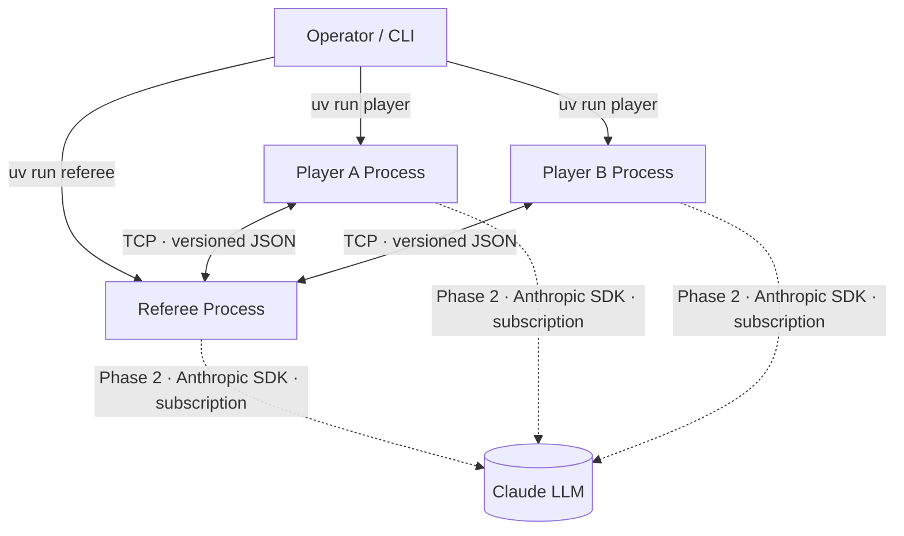
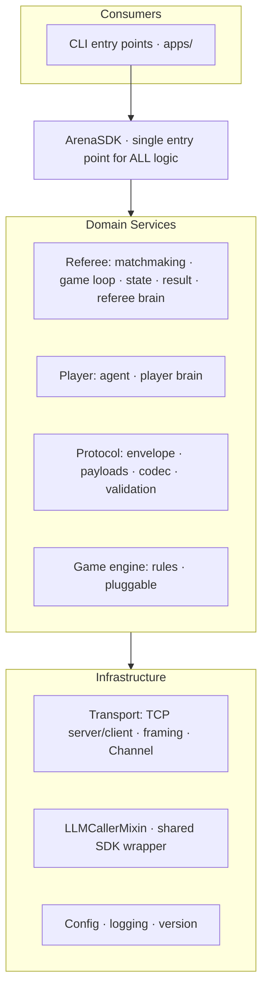
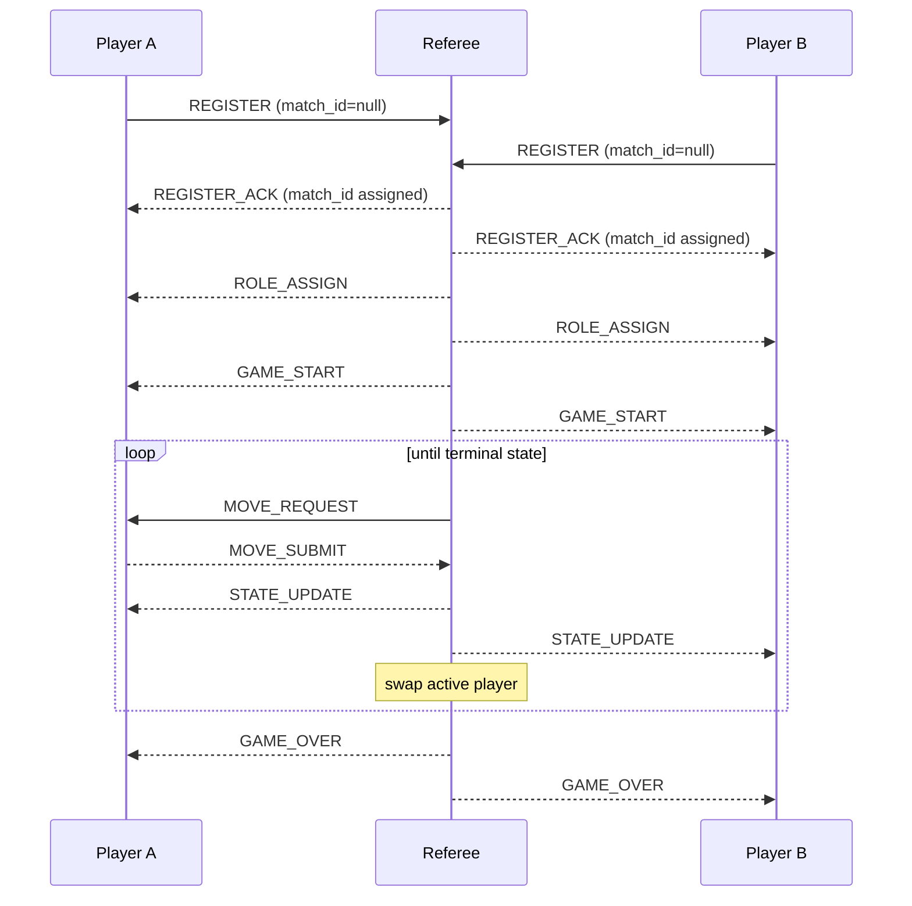

# Architecture & Plan (PLAN) — Agent Arena

| Field | Value |
|-------|-------|
| Project | `agent-arena` |
| Version | 1.00 |
| Date | 2026-05-24 |
| Status | Draft — pending approval before development |

> Follows guidelines §2.2, §4 (SDK), §5 (Gatekeeper — N/A this project), §15 (parallel
> processing), §16 (building blocks). Companion: [PRD.md](PRD.md) · [TODO.md](TODO.md).
> **No source code in this document — structure, interfaces in prose, and diagrams only.**

---

## 1. C4 — Context



Three separate OS processes. The **referee is the TCP server**; the two players are
**TCP clients**. Players never talk directly to each other. In Phase 2 all three agents
call the Anthropic SDK **directly** using the author's subscription — no custom gatekeeper
or rate-limiting layer (PRD §7, ADR-007).

---

## 2. C4 — Container / Process model

| Process | Role | Network role | Console script |
|---------|------|--------------|----------------|
| Referee | Orchestrator + referee brain | TCP **server** | `uv run referee` |
| Player A | Agent + player brain | TCP **client** | `uv run player` |
| Player B | Agent + player brain | TCP **client** | `uv run player` |

The same player program is launched twice; identity comes from CLI arguments + config,
not from separate code.

---

## 3. C4 — Components (logical layers)



**Architectural rules:**
- All business logic flows through **`ArenaSDK`**. Entry points contain no logic.
- Transport is hidden behind the **`Channel`** interface (ADR-006); domain services never
  touch sockets directly.
- The Anthropic SDK call lives in exactly one place: **`LLMCallerMixin`** (shared by
  referee and player LLM brains via mixin inheritance — no duplication, §4.2).

---

## 4. Project Structure (skeleton — no code)

```
agent-arena/
├── src/
│   └── agent_arena/
│       ├── __init__.py                  # __version__, public re-exports
│       ├── constants.py                 # immutable constants & config key names
│       ├── apps/                        # thin entry points — NO business logic
│       │   ├── __init__.py
│       │   ├── referee_app.py           # console script: referee
│       │   └── player_app.py            # console script: player
│       ├── sdk/
│       │   ├── __init__.py
│       │   └── sdk.py                   # ArenaSDK — single entry point for all logic
│       ├── services/
│       │   ├── __init__.py
│       │   ├── referee/
│       │   │   ├── __init__.py
│       │   │   ├── server.py            # referee lifecycle: bind, accept, teardown
│       │   │   ├── matchmaking.py       # wait for N players, reject extras, assign roles
│       │   │   ├── game_loop.py         # turn orchestration, timeout policy
│       │   │   ├── state.py             # match/game state model
│       │   │   ├── result.py            # terminal detection + GAME_OVER broadcast
│       │   │   └── brain/
│       │   │       ├── __init__.py
│       │   │       ├── base.py          # RefereeBrain abstract interface
│       │   │       ├── simple_brain.py  # Phase-1 placeholder (deterministic)
│       │   │       └── llm_brain.py     # Phase-2 LLM brain (uses LLMCallerMixin)
│       │   ├── player/
│       │   │   ├── __init__.py
│       │   │   ├── client.py            # TCP connection lifecycle, retry/backoff
│       │   │   ├── agent.py             # message-handling loop
│       │   │   └── brain/
│       │   │       ├── __init__.py
│       │   │       ├── base.py          # PlayerBrain abstract interface
│       │   │       ├── random_brain.py  # Phase-1 placeholder (random legal move)
│       │   │       └── llm_brain.py     # Phase-2 LLM brain (uses LLMCallerMixin)
│       │   ├── protocol/
│       │   │   ├── __init__.py
│       │   │   ├── message_types.py     # MessageType enum (all lifecycle types)
│       │   │   ├── envelope.py          # message envelope schema/dataclass
│       │   │   ├── payloads.py          # per-type payload schemas (split: 150-line rule)
│       │   │   ├── codec.py             # encode/decode envelope ↔ bytes
│       │   │   └── validation.py        # schema + protocol-version checks
│       │   └── game/
│       │       ├── __init__.py
│       │       ├── engine_base.py       # GameEngine abstract interface
│       │       └── trivial_game.py      # placeholder game (exercises the loop)
│       └── shared/
│           ├── __init__.py
│           ├── transport/
│           │   ├── __init__.py
│           │   ├── channel.py           # Channel interface (transport-agnostic)
│           │   ├── framing.py           # length-prefix framing over byte stream
│           │   ├── tcp_server.py        # bind/listen/accept + per-connection threads
│           │   └── tcp_client.py        # connect/send/recv with retry
│           ├── llm_caller.py            # LLMCallerMixin — wraps Anthropic SDK call
│           ├── config.py                # load + validate config files + version check
│           ├── logging_setup.py         # structured logging from logging_config.json
│           └── version.py               # VERSION = "1.00"
├── tests/
│   ├── conftest.py                      # shared fixtures (mock channels, fake config)
│   ├── unit/                            # mirrors src/agent_arena/ structure
│   └── integration/                     # full-match tests over real localhost sockets
├── docs/
│   ├── PRD.md
│   ├── PLAN.md
│   ├── TODO.md
│   ├── PROMPTS.md                       # prompt-engineering log (mandatory, §8.3)
│   ├── PRD_protocol.md                  # per-mechanism PRD (to be written)
│   ├── PRD_matchmaking.md               # per-mechanism PRD (to be written)
│   ├── PRD_game_engine.md               # per-mechanism PRD (to be written)
│   └── PRD_referee_brain.md             # per-mechanism PRD (to be written)
├── config/
│   ├── setup.json                       # host, port, player_count, move_timeout,
│   │                                    # lobby_timeout, heartbeat_interval, framing
│   │                                    # (versioned: "version": "1.00")
│   └── logging_config.json
├── data/                                # input data for experiments / test fixtures
├── results/                             # match logs, analysis outputs
├── notebooks/                           # Jupyter notebooks for match analysis
├── assets/                              # diagrams, screenshots
├── README.md                            # MANDATORY (see §5 for required sections)
├── pyproject.toml                       # build, deps, ruff, coverage, console scripts
├── uv.lock
├── .env-example                         # ANTHROPIC_API_KEY=<your-key>
└── .gitignore                           # must include: .env, *.key, *.pem,
                                         # credentials.json, __pycache__, .venv
```

Every file stays **≤ 150 code lines**; split by responsibility when the limit approaches.

---

## 5. Building Blocks (Input / Output / Setup — prose only, no code)

Each block is a self-contained, single-responsibility unit (guidelines §16).

### 5.1 `Channel` (transport abstraction)
- **Setup:** an established connection/transport handle (or a mock in tests).
- **Input:** a message object to send.
- **Output:** the next received message object (blocking, with timeout).
- **Purpose:** decouples domain services from TCP. New transport = new `Channel` impl.

### 5.2 `Framing`
- **Setup:** framing scheme from config (length-prefix, 4-byte big-endian header).
- **Input:** raw bytes from the socket stream.
- **Output:** complete, boundary-correct message bytes (no partial-read leaks upward).
- **Edge cases:** oversized frame (reject), truncated stream (wait or error).

### 5.3 `Codec`
- **Input:** an envelope object → bytes (encode) / bytes → envelope object (decode).
- **Output:** bytes / typed envelope.
- **Edge cases:** malformed JSON, unknown fields, truncated payload.

### 5.4 `MessageValidator`
- **Input:** a decoded envelope.
- **Output:** validated envelope, or a typed rejection.
- **Rejects:** incompatible `protocol_version`, unknown `type`, malformed payload.

### 5.5 `Matchmaking`
- **Setup:** `player_count`, role set, `lobby_timeout` (all from config).
- **Input:** `REGISTER` messages from connecting players.
- **Output:** role assignment per player; REGISTER_ACK per player; GAME_START signal.
- **Edge cases:** 3rd player rejected; lobby timeout if 2nd player never arrives.

### 5.6 `GameLoop`
- **Setup:** a `GameEngine`, channels to both players, `move_timeout`.
- **Input:** `MOVE_SUBMIT` messages.
- **Output:** `STATE_UPDATE` broadcasts, and finally a `GAME_OVER`.
- **Also uses:** the `RefereeBrain` for any referee-level decisions during the loop.

### 5.7 `GameEngine` (pluggable rules)
- **Input:** current state + a proposed move.
- **Output:** is-legal flag, next state, is-terminal flag, result-if-terminal, legal-move hints.
- **Phase 1 impl:** `trivial_game` (minimal deterministic game for loop validation).

### 5.8 `PlayerBrain` (player intelligence)
- **Setup:** assigned role + game configuration.
- **Input:** current state + legal-move hints.
- **Output:** a chosen move.
- **Phase 1 impl:** `random_brain` — picks a random legal move.
- **Phase 2 impl:** `llm_brain` — builds a prompt from state + role, calls `LLMCallerMixin`.

### 5.9 `RefereeBrain` (referee intelligence)
- **Setup:** game configuration + referee role description.
- **Input:** a `RefereeContext` (state, players' last actions, decision type requested).
- **Output:** a `RefereeDecision` (interpretation, ruling, generated content, etc.).
- **Phase 1 impl:** `simple_brain` — returns a deterministic/scripted response.
- **Phase 2 impl:** `llm_brain` — calls `LLMCallerMixin` with a referee-specific prompt.

### 5.10 `LLMCallerMixin` (shared SDK wrapper)
- **Setup:** model name and system-prompt template (from config or caller).
- **Input:** a human-turn prompt string.
- **Output:** the model's response string.
- **Note:** this mixin is the **only** place the `anthropic` SDK is imported. Both
  `referee/brain/llm_brain.py` and `player/brain/llm_brain.py` inherit from it —
  zero duplication (guidelines §4.2 mixin rules).
- **Auth:** reads `ANTHROPIC_API_KEY` from the environment; never from config files.

---

## 6. Message Protocol

### 6.1 Envelope (carried on every message)
| Field | Type | Notes |
|-------|------|-------|
| `protocol_version` | string | e.g. `"1.0"` |
| `type` | string | one of the `MessageType` enum values |
| `match_id` | string \| null | **null on `REGISTER`** (no match exists yet); assigned by referee in `REGISTER_ACK` and present on all subsequent messages |
| `sender` | string | agent id |
| `seq` | int | per-sender monotonic counter |
| `timestamp` | string | ISO-8601 UTC |
| `payload` | object | type-specific (see §6.2) |

### 6.2 Message types
| Type | Direction | `match_id` | Purpose |
|------|-----------|------------|---------|
| `REGISTER` | player → referee | **null** | announce agent id/name + protocol version |
| `REGISTER_ACK` | referee → player | assigned here | accept (with match_id) or reject (with reason) |
| `ROLE_ASSIGN` | referee → player | present | assign the player's role + game config |
| `GAME_START` | referee → both | present | initial state, match begins |
| `MOVE_REQUEST` | referee → active player | present | request a move + state + legal-move hints |
| `MOVE_SUBMIT` | player → referee | present | the chosen move |
| `STATE_UPDATE` | referee → both | present | new state after a validated move |
| `GAME_OVER` | referee → both | present | terminal result + reason |
| `ERROR` | either direction | present | typed error (bad move, bad version, timeout) |
| `HEARTBEAT` | either direction | present | liveness ping (config-gated; interval from setup.json) |

### 6.3 Sequence — happy path



### 6.4 Failure paths
| Failure | Referee action |
|---------|----------------|
| Move timeout | Apply configured policy (forfeit / skip / retry); broadcast `GAME_OVER` or `ERROR` |
| Player disconnect | Detect via socket error; end match deterministically; log cause |
| 3rd connection attempt | Reject immediately; do not disrupt active match |
| Lobby timeout (2nd player never arrives) | Cancel match; notify connected player; shut down |
| Incompatible protocol version | Send `REGISTER_ACK` reject; close connection |

---

## 7. Concurrency Model (guidelines §15)

- **Across agents — multiprocessing (OS processes):** true isolation. A player crash
  cannot affect the referee's state or memory.
- **Inside the referee — multithreading (I/O-bound):** socket I/O is I/O-bound.
  One thread per player connection hands incoming messages to a thread-safe `Queue`;
  a single **coordinator thread** owns the authoritative game state and drives the loop.
  All shared state is guarded (lock or thread confinement) — no unsynchronised access.
- **Inside a player:** single connection thread. The brain call (I/O-bound LLM in Phase 2)
  runs on a worker thread with a timeout so the network loop stays responsive.
- **Thread-safety checklist (§15.3):** identify I/O-bound operations ✓; dynamic thread
  count per config ✓; proper resource cleanup on error ✓; protect shared state,
  prevent deadlock and race conditions ✓.

---

## 8. LLM Integration (Phase 2)

All three agents use the Anthropic Python SDK directly — no custom gatekeeper or
rate-limiting layer (this is a local dev/test project, not a deployment; PRD §7).

- `LLMCallerMixin` wraps the single SDK import and call.
- Auth: `ANTHROPIC_API_KEY` from the environment (documented in `.env-example`).
- Model name comes from `config/setup.json` — never hardcoded.
- No token-cost tracking, no request queuing, no retry beyond the SDK's default.

---

## 9. Configuration Architecture (guidelines §7)

```
config/setup.json          host, port, player_count, move_timeout,
                           lobby_timeout, heartbeat_interval,
                           framing_scheme, llm_model_name
                           "version": "1.00"

config/logging_config.json log levels, handlers, output path

.env                       ANTHROPIC_API_KEY=...   ← git-ignored
.env-example               ANTHROPIC_API_KEY=<your-key>  ← committed

src/.../shared/version.py  VERSION = "1.00"
src/.../constants.py       immutable keys, enum-like defaults
```

The app validates that `setup.json["version"]` matches the expected version at startup.
No value that should come from config is ever hardcoded in source.

---

## 10. Architecture Decision Records (ADRs)

| ADR | Decision | Rationale | Trade-off |
|-----|----------|-----------|-----------|
| ADR-001 | Three OS processes over TCP | True isolation; realistic agent model | More plumbing than threads |
| ADR-002 | Referee is TCP server; players are clients | Single authority for rules and matchmaking | Third player needs explicit rejection logic |
| ADR-003 | Versioned JSON envelope with length-prefix framing | Debuggable; forward-compatible | Slightly more overhead than binary |
| ADR-004 | Pluggable `GameEngine` | Network layer stays game-agnostic | Abstract interface adds indirection |
| ADR-005 | Pluggable `Brain` (both referee and player) | Phase 2 LLM swap with zero transport change | Indirection in decision path |
| ADR-006 | `Channel` transport abstraction | Future broker/WebSocket = new `Channel` impl | One extra layer |
| ADR-007 | No gatekeeper; LLM called directly via subscription | Dev/test project; subscription covers usage; no deployment | Not suitable for production or shared API key |
| ADR-008 | `match_id` is null on `REGISTER`; assigned in `REGISTER_ACK` | No match exists before registration completes | Clients must handle null `match_id` before ACK |

---

## 11. Testing Strategy (guidelines §6)

- **TDD:** tests written before/alongside each module (red → green → refactor).
- Every public function has ≥ 1 test covering the happy path and ≥ 1 covering an error path.
- Transport is **mocked** in all unit tests via an in-memory `Channel`; integration tests
  use real `localhost` sockets.
- Global coverage **≥ 85 %**, enforced in `pyproject.toml`:

```toml
[tool.coverage.run]
source = ["src"]
omit = ["src/agent_arena/apps/*", "*/tests/*"]

[tool.coverage.report]
fail_under = 85
```

- Edge cases covered: 3rd player rejected, malformed message, move timeout,
  mid-match disconnect, incompatible protocol version, lobby timeout, empty legal-move list.

---

## 12. Extension Points (guidelines §12)
| Extension | How |
|-----------|-----|
| New game | New `GameEngine` implementation |
| New player intelligence | New `PlayerBrain` implementation |
| New referee intelligence | New `RefereeBrain` implementation |
| New transport | New `Channel` implementation |
| New message type | Add to `MessageType` enum + `payloads.py` + `validation.py`; bump protocol version |
| RAG-backed brain | Extend `LLMCallerMixin` with a retrieval step (Phase 3+) |
