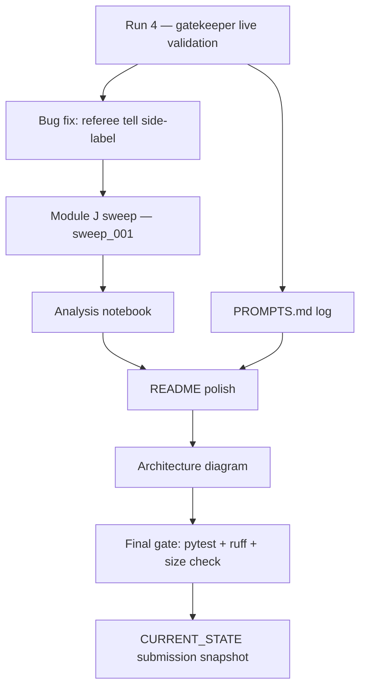

# PLAN — Submission Finalization

| Field    | Value                                       |
|----------|---------------------------------------------|
| Document | `PLAN_submission.md`                        |
| Project  | `agent-arena`                               |
| Version  | 1.00                                        |
| Date     | 2026-05-28                                  |
| Status   | Draft — pending approval before execution   |

> Companion: [PRD_submission.md](PRD_submission.md) · [TODO_submission.md](TODO_submission.md)
> No source code in this document — execution order, artifact list, ADRs, and diagrams only.

---

## 1. Execution Order (gated, not parallel)

Rationale for the ordering:

- **A first.** No sweep before the gatekeeper is shown to work on a live match;
  otherwise a bad sweep burns budget without diagnostic value.
- **B before C.** The side-label bug pollutes every sweep trajectory; cheap to fix
  first.
- **D depends on C.** The notebook reads `sweep_001/`.
- **E can run in parallel with A/B/C** — it's a docs sweep, no code dependency.
- **F depends on D and E** — README screenshots come from the notebook; the config
  section needs the final PROMPTS structure to reference.
- **G after F** so the diagram matches the prose.
- **H last** so the final gate covers everything that landed in this triplet.

---

## 2. Artifacts Produced

| Artifact                                                       | Created by      | Lives at                                            |
|----------------------------------------------------------------|-----------------|-----------------------------------------------------|
| `docs/devlog/2026-05-28-run4-gatekeeper-live.md`               | Run 4           | `docs/devlog/`                                      |
| Match trajectory for Run 4                                     | Run 4           | `results/<match-id>_trajectory.jsonl`               |
| `results/sweep_001/<match-id>_trajectory.jsonl` (≥ 250)        | Sweep runner    | `results/sweep_001/`                                |
| `results/sweep_001/summary.json`                               | Sweep runner    | `results/sweep_001/`                                |
| `notebooks/analysis.ipynb` + `analysis.html`                   | Author          | `notebooks/`                                        |
| `docs/PROMPTS.md`                                              | Author          | `docs/`                                             |
| `assets/architecture.png` (+ optional `.mmd` source)           | Author          | `assets/`                                           |
| Updated `README.md`                                            | Author          | repo root                                           |
| Updated `CURRENT_STATE.md`                                     | Author          | `docs/`                                             |
| `docs/devlog/2026-05-28-submission-gate.md`                    | Final gate      | `docs/devlog/`                                      |

No source code under `src/` changes in this triplet **except** the
`[referee tell]` bug fix in §5.4 of the PRD.

---

## 3. Components Touched

| Layer            | Touched? | Notes                                                                  |
|------------------|----------|------------------------------------------------------------------------|
| Transport / TCP  | No       | Frozen; AC9 already established.                                       |
| Protocol         | No       | Frozen.                                                                |
| Referee brains   | Yes      | Only `[referee tell]` label-swap fix (one function, one test).         |
| Player brains    | No       | Frozen.                                                                |
| Gatekeeper       | No       | Frozen (validated by Run 4, not modified).                             |
| Sweep harness    | No       | Used as-is; if FR-SW-4 reveals it does not halt cleanly on gatekeeper exhaustion, that becomes a new triplet, not part of this one. |
| Docs             | Yes      | README, PROMPTS, devlog, CURRENT_STATE.                                |
| Notebooks        | Yes      | `analysis.ipynb` is the deliverable.                                   |
| Assets           | Yes      | One architecture diagram added.                                        |

---

## 4. ADRs

| ADR        | Decision                                                                                | Rationale                                                                                                          |
|------------|-----------------------------------------------------------------------------------------|--------------------------------------------------------------------------------------------------------------------|
| S-001      | Single sweep run is sufficient for the submission                                       | The assignment asks for analysis at scale, not a model bake-off; one well-run sweep + clear writeup beats two rushed sweeps. |
| S-002      | Run 4 is a gate, not a checkbox                                                         | If Run 4 surfaces a real gatekeeper bug, we fix it before the sweep — burning paid-tier budget on a broken gatekeeper is the worst outcome. |
| S-003      | `quota_aborted` matches in the sweep are *kept*, not retried                            | They are evidence the gatekeeper surfaces capacity events correctly; the notebook reports their rate as a quality metric, not a bug. |
| S-004      | Analysis lives in a notebook, not a generated report                                    | Grader can re-run cells against `results/sweep_001/`; reproducibility > polish.                                    |
| S-005      | `[referee tell]` fix lands in its own commit, before the sweep                          | Keeps the sweep trajectories clean and the commit history readable for grading.                                    |
| S-006      | README screenshots come from the notebook outputs, not staged transcripts               | Single source of truth: if the sweep is re-run, the README figures regenerate from the same data.                  |
| S-007      | `docs/PROMPTS.md` is authored from the prompts currently in source, not reconstructed   | The log records the prompts that produced the sweep — historical accuracy matters more than completeness of every prior iteration. |
| S-008      | No CI                                                                                   | Submission is local; CI adds setup cost and learns nothing new (gate already runs locally and is logged).          |

---

## 5. Risks → Mitigations (executable)

| Risk                                                | Trigger                                       | Action                                                       |
|-----------------------------------------------------|-----------------------------------------------|--------------------------------------------------------------|
| Run 4 forfeits a turn (gatekeeper bug)              | Verdict shows `timeout` flag with no quota banner | Open follow-up triplet; do not start sweep.                  |
| Run 4 quota-aborts immediately                      | First `acquire` raises `GatekeeperOpenError` | Check breaker config; likely `breaker_threshold` too tight.   |
| Sweep cost overshoots $15                           | GCP budget alert email                        | Halt sweep; analyze partial; document cost in notebook.       |
| Sweep `summary.json` malformed                      | Notebook load step fails                      | Sweep runner has unit test for `summary.json` schema; backfill from per-match trajectories if needed. |
| `[referee tell]` fix breaks golden-file tests       | Pytest red                                    | Update goldens in the same commit only if the new text is provably correct; otherwise revert. |
| Notebook nondeterminism (random sample order)       | Re-run produces different figures             | Seed any random draws; sort match list deterministically.    |

---

## 6. Definition of Submission-Ready

The submission is considered ready when **all of** the following are true on
`master`:

1. `git status` is clean.
2. `uv run pytest -q` is green; coverage ≥ 85 %.
3. `uv run ruff check src tests` is clean.
4. `results/sweep_001/summary.json` exists with `completed ≥ 250`.
5. `notebooks/analysis.ipynb` opens and runs top-to-bottom.
6. `README.md` has all seven sections from PRD §5.5.
7. `docs/PROMPTS.md` has at least 3 entries.
8. `CURRENT_STATE.md` reads as a one-screen submission snapshot.
9. The Run 4 devlog exists and references the actual match-id.
10. `docs/devlog/2026-05-28-submission-gate.md` shows the final gate output.

The day a checkbox is ticked on every line above, the project is submittable.

---

## 7. What This Plan Deliberately Does NOT Do

- Does not add CI.
- Does not add a second sweep.
- Does not refactor any existing source file beyond the one-line bug fix.
- Does not introduce any new dependency.
- Does not touch the gatekeeper config (the values from
  [PRD_api_gatekeeper.md FR-CFG4](PRD_api_gatekeeper.md) are accepted as-is).
- Does not re-open any closed PRD/PLAN/TODO from earlier phases.

If any of the above feels needed during execution, it becomes a **separate**
triplet and a separate submission decision — not a scope-creep into this one.
